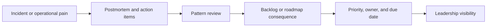

# Operating Model

## In One Sentence

One language for priorities, one rhythm for delivery, one release truth, and one scorecard leadership can trust.

## Operating Principles

- Platform is a product, not a bucket of internal chores.
- Reliability, release confidence, and operational leverage are first-class outcomes.
- Process exists to reduce drag, not to document drag.
- Every material risk needs an owner, a date, and a consequence.
- Incidents are not a separate universe from product management.

## The Planning Stack

| Layer | Question it answers | Format | Owner |
|---|---|---|---|
| Outcome | What business or platform result matters this quarter? | Quarterly outcome brief | PM + platform leadership |
| Theme | Where are we investing to move that result? | Roadmap themes | PM |
| Epic | What cross-team initiative are we committing to? | Epic brief with success criteria and gate | PM + engineering lead |
| Issue | What work is being executed now? | GitHub issue | Engineering |
| Decision | What tradeoff was made and why? | Decision log | PM + relevant lead |
| Incident follow-up | What changed after failure? | Postmortem action tracker | Engineering lead + PM |

The rule is simple:

- Notion carries context and decisions.
- GitHub carries execution.
- Neither tool should pretend to be the other.

## Core Cadences

| Cadence | Attendees | Purpose | Output |
|---|---|---|---|
| Weekly delivery triage | PM, Director/lead engineers | Review active epics, blockers, ETA confidence, interrupt load | Updated risk view and unblocker owners |
| Weekly release and upgrade review | PM, release owner, ops, support / solution rep when needed | Review readiness, compatibility, rollback posture | Go / no-go risk register |
| Weekly dependency sync | PM, peer PMs, partner teams | Resolve cross-team dependencies and handoffs | Dependency board with owners and dates |
| Biweekly sprint rhythm | Engineering + PM | Planning, review, retro without over-managing implementation | Clear commitments and retro actions |
| Monthly platform health review | PM, platform leadership | Review reliability, toil, change failure, upgrade health | Investment or sequencing adjustments |
| Monthly roadmap and risk review | VP / Director / PM | Review theme progress, risks, and decisions needed | Confirmed priorities and escalations |

## Incident-To-Roadmap Loop

This is the most important operating behavior in the system.

Rule:
If the same class of pain happens twice, it deserves an explicit investment conversation.

## Dashboard Model

Leadership should not need four tools and tribal history to understand platform health.

The operating scorecard should answer four questions:

1. Is delivery on track?
2. Is the platform healthy?
3. Are upgrades and releases getting safer?
4. Are we reducing manual operational work?

Those four questions become the metric groups in the [Platform Scorecard](07-platform-scorecard.md).

## Communication Model

Different audiences need different fidelity.

| Audience | What they need |
|---|---|
| Engineers | Scope clarity, blockers, what changed, what matters now |
| Leadership | Risk, confidence level, decisions needed, tradeoffs |
| Partner teams | Dates, dependencies, supported paths, who owns what |

Good communication here is not verbosity. It is reduction without distortion.

## What To Standardize Early

- one epic brief format
- one dependency board with owner and due date
- one release calendar for cloud and self-hosted milestones
- one decision log for non-trivial tradeoffs
- one incident-to-backlog review loop

## What To Defer

- every engineering workflow detail
- one universal document format for every audience
- a heavy process for low-risk work
- a scorecard with metrics nobody trusts yet

## Anti-Patterns

### Process theater

If the team spends more energy feeding the system than using it, the system is wrong.

### Reporting before diagnosis

If the PM optimizes dashboards before understanding how work really flows, the outputs may look clean while the system stays confused.

### Artificial roadmap confidence

If interrupt work is not explicitly budgeted, roadmap confidence is decorative.

## Read Next

[30-60-90 Plan](04-30-60-90-plan.md)
