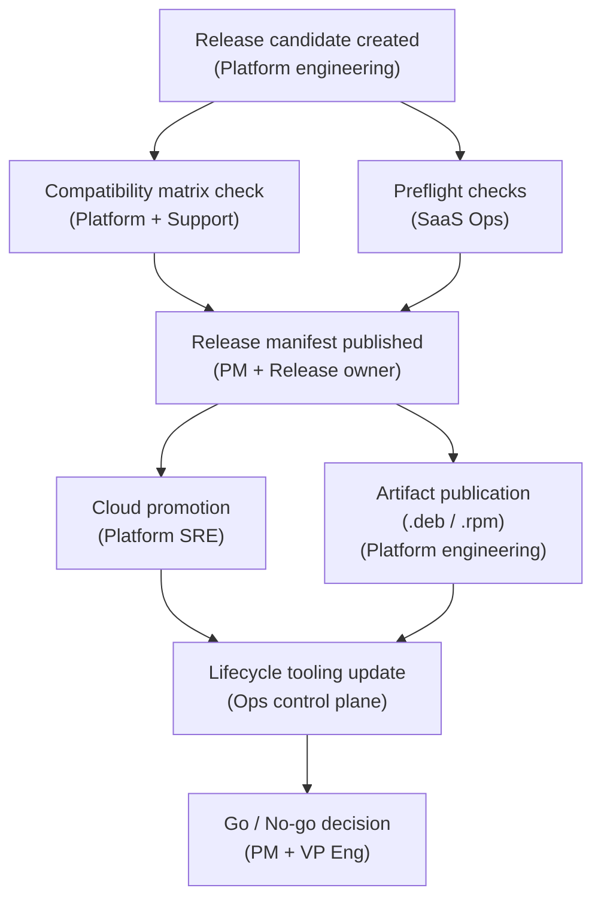

# Flagship Initiative: Unified Release Orchestration

## Why This Initiative

This is the best first showcase initiative because it sits at the seam between all three platform surfaces:

- managed cloud operations
- self-hosted deployment artifacts
- internal SaaS lifecycle tooling

If release and upgrade coordination becomes easier, a large share of the organization's delivery friction starts to drop with it.

## Problem

Release readiness, compatibility knowledge, and upgrade confidence are often scattered across people, ticket comments, checklists, and memory. That creates avoidable friction:

- teams rediscover the same constraints
- cloud and self-hosted release paths drift
- support absorbs avoidable escalation load
- leadership gets late surprises instead of early tradeoff signals

## Product Goal

Create one shared release truth that lets teams validate, promote, communicate, and support releases from the same operating model.

## Epic Hypothesis

If we create a unified release orchestration model for platform engineers, operators, and customer-facing deployment partners, then we will reduce release risk and coordination drag because teams will stop validating and communicating from fragmented sources of truth.

## Desired Outcomes

| Outcome | Target |
|---|---|
| Release-related escalation rate | -30% |
| Time from release candidate to readiness sign-off | -20% |
| Supported upgrade success rate | 88% -> 97% |
| Releases with complete manifest, compatibility note, and rollback plan | 100% |

## Scope

### In scope

- shared release manifest
- compatibility matrix across supported versions and deployment paths
- preflight checks for high-risk upgrade conditions
- promotion workflow with explicit readiness states
- compact release dashboard for blockers, confidence, and decisions needed

### Out of scope

- replacing every existing CI/CD tool
- solving every possible environment variation in v1
- a full internal developer portal rebuild
- customer-facing UI changes unrelated to release and upgrade confidence

## Key User Stories

### Story 1: Release owner

As a release owner, I want one release manifest for every candidate so I can see component versions, artifact versions, risks, blockers, and readiness in one place.

**Acceptance criteria:**
- Every release candidate has a manifest created at branch cut with component versions, artifact versions, and a rollback reference
- The manifest shows a readiness state (Draft / In Review / Ready / Blocked) visible to all participating teams
- Blockers are surfaced on the manifest with an owner and due date
- The manifest is the single authoritative source — no parallel Slack threads or spreadsheet needed to understand release status

### Story 2: Support / solution partner

As a deployment-facing partner, I want a compatibility matrix and clear upgrade guidance so I can advise customers without relying on tribal knowledge.

**Acceptance criteria:**
- The compatibility matrix covers all currently supported version pairs across cloud and self-hosted paths
- Each supported upgrade path has a confidence level (Validated / Conditional / Not supported) with a plain-language rationale
- Known environment-specific failure conditions are documented with workarounds or blockers
- Partners can find the matrix without asking an engineer

### Story 3: SaaS operator

As a SaaS operator, I want preflight checks before promotion so I can catch obvious dependency and environment issues before rollout.

**Acceptance criteria:**
- Preflight checks run automatically before any standard promotion event
- Checks cover: dependency version alignment, SLO baseline health, pending blocker flags, and rollback reference validity
- A failed check produces a clear pass / fail with the specific condition that failed
- Operators can override with an explicit acknowledgement and owner signature

### Story 4: Leadership stakeholder

As a VP or Director, I want a compact release dashboard so I can see what is ready, what is blocked, and what decisions are required — without digging through Jira or Slack.

**Acceptance criteria:**
- The dashboard shows current release status across all three platform surfaces on one screen
- Blocked items surface with the owner and the age of the block
- Confidence level is explicit (Low / Medium / High) with a one-line rationale
- Decisions needed are called out separately from status updates
- The dashboard refreshes at least daily without manual curation

## Risks

| Risk | Mitigation |
|---|---|
| The model becomes too heavy and people bypass it | Keep v1 focused on a small number of required fields and states |
| Supported environments are not bounded | Explicitly define supported paths and defer edge cases |
| Dashboard becomes a commitment machine | Present confidence and readiness, not false certainty |
| Teams disagree on release states | Align terminology before tooling details |

## Decision Gates

| Gate | Question |
|---|---|
| Gate 1 | Do all participating teams agree on readiness states and minimum manifest data? |
| Gate 2 | Can v1 cover the majority of standard releases without adding net process overhead? |
| Gate 3 | Are escalations and blocker churn visibly reducing after adoption? |

## Cross-Surface Dependency Map

The initiative sits at the seam between all three surfaces. These are the critical
handoffs that the unified release model must handle:

Historical drag points:
- Compatibility check and preflight ran in parallel with no shared output → each team discovered the same blockers independently
- Artifact publication had no explicit readiness gate → cloud and self-hosted releases drifted by 3-7 days regularly
- Go / no-go decisions happened in Slack with no audit trail → leadership had no durable view of what was decided and why

## Why This Initiative Matters

This initiative shows the real work of a strong Platform PM:

- aligning across engineering and customer-facing partners
- making risk legible without collapsing nuance
- reducing coordination tax
- connecting release quality to business trust

## Read Next

[Platform Scorecard](07-platform-scorecard.md)
