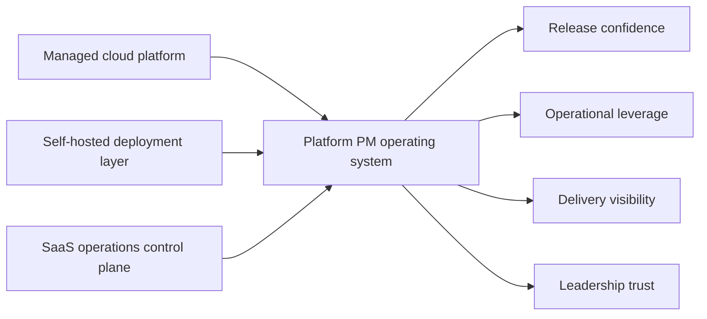

# Hiring Manager Summary

## What Project Atlas Shows

Project Atlas is a one-repo answer to a simple hiring question:

Can this candidate run platform product management in a way that helps engineers move faster, makes leadership less blind, and turns operational pain into better decisions?

My answer is yes, and this portfolio shows how.

## In One Page

| What I am demonstrating | What it looks like in practice |
|---|---|
| Clear Platform PM scope | I define Platform PM as product management for release confidence, operational leverage, dependency flow, and delivery visibility |
| Good diagnosis before process | I infer likely pain and risk before proposing rituals or dashboards |
| Lightweight operating model design | I install cadences, decision logs, dependency review, and incident-to-roadmap loops without drowning the team |
| Business-legible platform thinking | I translate reliability, upgrade safety, and toil into outcomes leadership can prioritize |
| Strong communication | I show how I would write weekly updates, risk escalations, and decision logs without falling into status theater |

## The System I Would Run

## What Matters Most In My Approach

- I do not treat platform work as a pile of technical chores. I treat it as a product surface that deserves outcome language and prioritization discipline.
- I do not mistake more reporting for more control. I prefer a smaller number of trusted signals.
- I assume release and upgrade quality are strategic, not operational afterthoughts.
- I believe incidents should change roadmap choices when patterns repeat.
- I optimize for legibility: engineers know what matters, leadership knows what is true, and partner teams know where decisions live.

## If You Only Read Three Files

1. [Platform Thesis](01-platform-thesis.md)
   This shows how I think about the role.
2. [Operating Model](03-operating-model.md)
   This shows how I would run the work.
3. [Flagship Initiative](06-flagship-initiative.md)
   This shows how I turn platform strategy into execution.

## What You Should Conclude

- I understand the difference between feature PM work and platform PM work.
- I can create structure without defaulting to bureaucracy.
- I can make platform work legible to non-platform stakeholders.
- I can connect roadmap, risk, release quality, and operational leverage into one system.

## The Best Fit For This Portfolio

This work is most relevant for organizations that:

- run both SaaS and self-hosted or multi-environment deployments
- feel friction at the seams between engineering, support, and customer operations
- want better delivery predictability without heavier process
- need a PM who can operate comfortably with platform and infrastructure leaders

## Back To

[README](README.md)
