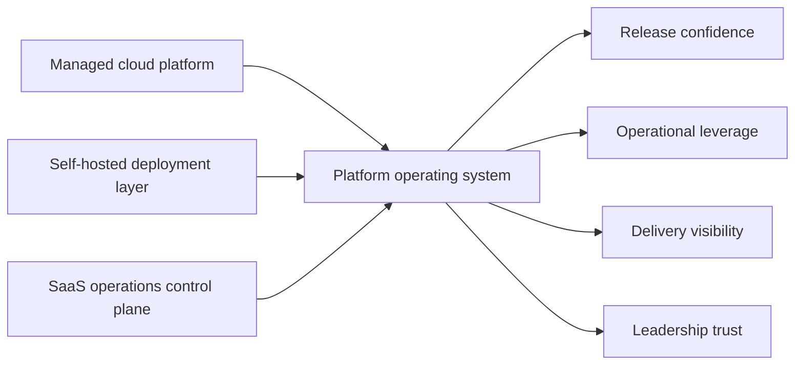

# Platform Operating System — Product Overview

## What This Is

Project Atlas is a platform PM case study documenting the operating system designed and
installed for Meridian's three-surface cloud platform.

The platform spans a managed cloud product, a self-hosted deployment layer for regulated
enterprise customers, and an internal SaaS operations control plane. The PM challenge is
to make these three surfaces act like one product system — with consistent release
confidence, operational leverage, and delivery visibility.

## The Operating System In One View

## What The Operating System Delivers

| Capability | What it looks like in practice |
|---|---|
| Release confidence | One release truth across cloud and self-hosted surfaces; readiness is explicit before promotion |
| Operational leverage | Provisioning and upgrade actions require fewer manual steps; toil is tracked and reduced |
| Delivery visibility | Active work, blockers, and risk are legible at all times without a manual chase |
| Incident-to-roadmap loop | Repeated operational pain translates into explicit backlog and investment decisions |
| Leadership signal quality | Risk, confidence, and decisions needed — surfaced early, not after dates slip |

## Principles

- Platform is a product, not a bucket of internal chores.
- Release and upgrade quality are strategic, not operational afterthoughts.
- Process exists to reduce drag. It earns the right to exist or it gets removed.
- Incidents that repeat deserve roadmap consequences, not just postmortems.
- Legibility is the output. Engineers know what matters. Leadership knows what is true.

## If You Read Three Files

1. [Platform Thesis](01-platform-thesis.md) — the point of view on what Platform PM owns
2. [Operating Model](03-operating-model.md) — how the work runs
3. [Flagship Initiative](06-flagship-initiative.md) — the operating system in execution

## Full Artefact Map

| Phase | Artefact | What it shows |
|---|---|---|
| 0. Framing | [Project Brief](00-project-brief.md) | Scope, north star, outcome targets |
| 1. Point of view | [Platform Thesis](01-platform-thesis.md) | What Platform PM owns and why it matters |
| 2. Diagnosis | [Current-State Assessment](02-current-state-assessment.md) | Pain, risk, and operating seams |
| 3. Operating system | [Operating Model](03-operating-model.md) | Cadences, decision hygiene, incident loop |
| 4. Entry | [30-60-90 Plan](04-30-60-90-plan.md) | How the first quarter was structured |
| 5. Direction | [Roadmap](05-roadmap.md) | Outcome-led sequencing across surfaces |
| 6. Execution | [Flagship Initiative](06-flagship-initiative.md) | Unified release orchestration in depth |
| 7. Measurement | [Platform Scorecard](07-platform-scorecard.md) | Metrics, review model, Q1 sample data |
| 8. Communication | [Executive Communication Samples](08-executive-communication-samples.md) | Weekly update, decision log, risk escalation |
| 9. Incident review | [Incident Review Sample](09-incident-review-sample.md) | Postmortem and roadmap consequence |
