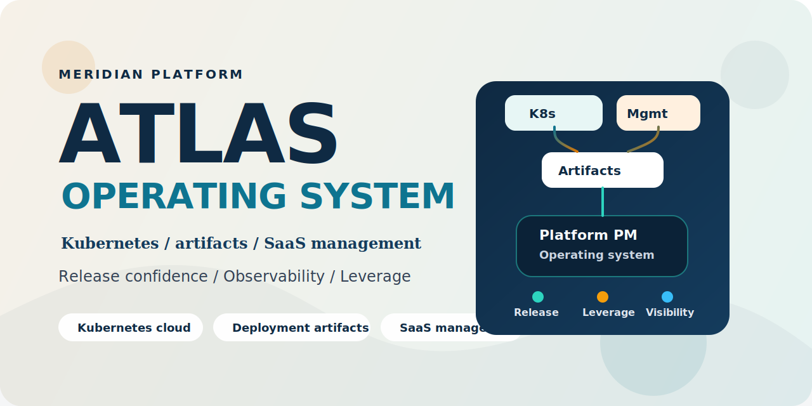
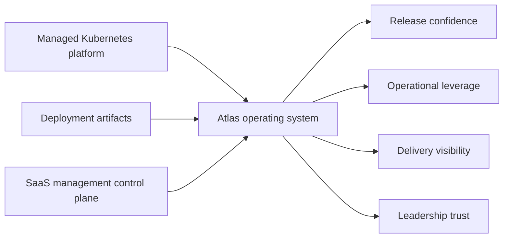

# Atlas: Platform Operating System

Prepared by [@7ahir](https://github.com/7ahir)

> Delivery visibility, release confidence, and operational leverage for Meridian's Kubernetes platform, deployment artifacts, and SaaS management control plane.

## What This Is

Atlas documents the platform operating system designed and installed for Meridian, a B2B cyber operations company with an open-source core and an enterprise SaaS offering. Meridian's products are distributed both as open-source software, deployed by a global community of self-hosted operators, and as a managed SaaS for regulated enterprise customers in financial services, healthcare, and the public sector.

The platform spans:
- a managed Kubernetes platform on bare metal that runs the enterprise SaaS product
- a self-hosted deployment layer covering Helm charts, Docker Compose, and appliance images, serving regulated and air-gapped enterprise deployments alongside open-source community installs
- an internal SaaS management control plane for tenant provisioning, upgrades, configuration, and lifecycle management

The operating system connects these three surfaces into one release, delivery, reliability, and operational model.

## The Core Thesis

Platform PM is not backlog administration for infrastructure teams.

A strong Platform PM:
- makes release and upgrade reality visible
- reduces waiting caused by dependency and decision latency
- translates reliability, operability, and toil into business-legible tradeoffs
- installs a delivery system that helps engineers move with less friction
- turns incidents into roadmap consequences instead of recurring pain

Atlas shows how that operating system was built and run at Meridian.

## System View

## How To Read This

| Time | Path | What you will get |
|---|---|---|
| 2 min | [Platform Overview](PRODUCT_OVERVIEW.md) | Fastest read on what the operating system is and what it delivers |
| 5 min | [Project Brief](00-project-brief.md) -> [Platform Thesis](01-platform-thesis.md) -> [Roadmap](05-roadmap.md) | Fast read on the problem, point of view, and plan |
| 20 min | [Operating Model](03-operating-model.md) -> [Flagship Initiative](06-flagship-initiative.md) -> [Platform Scorecard](07-platform-scorecard.md) | How the work runs, not just how it is described |
| Deep dive | Follow the files in order from `00` to `09` | Full diagnosis-to-execution arc |

## Artifact Map

| Phase | Artifact | What it demonstrates |
|---|---|---|
| Overview | [Platform Overview](PRODUCT_OVERVIEW.md) | What the operating system is and what it delivers |
| 0. Framing | [Project Brief](00-project-brief.md) | Strategic framing and scope definition |
| 1. Point of view | [Platform Thesis](01-platform-thesis.md) | Clear understanding of what Platform PM owns and why it matters |
| 2. Diagnosis | [Current-State Assessment](02-current-state-assessment.md) | Ability to infer pain, risk, and operating seams before jumping to solutions |
| 3. Operating system | [Operating Model](03-operating-model.md) | Cadence design, decision hygiene, dependency management, and incident-to-roadmap loops |
| 4. Entry strategy | [30-60-90 Plan](04-30-60-90-plan.md) | How the first quarter was structured |
| 5. Direction | [Roadmap](05-roadmap.md) | Outcome-led sequencing across platform surfaces |
| 6. Execution depth | [Flagship Initiative](06-flagship-initiative.md) | A concrete cross-surface initiative that proves platform PM leverage |
| 7. Measurement | [Platform Scorecard](07-platform-scorecard.md) | The metrics and review model used to govern delivery and platform health |
| 8. Communication | [Executive Communication Samples](08-executive-communication-samples.md) | Weekly update, decision log, and risk escalation samples |
| 9. Incident review | [Incident Review Sample](09-incident-review-sample.md) | Postmortem and roadmap consequence |

## Scenario

Meridian is a B2B cyber operations company (Series C, ~$85M ARR, 190 engineers) with an open-source core and an enterprise SaaS offering. Its platform spans three coupled surfaces:

| Surface | Role in the business | Typical pain when unmanaged |
|---|---|---|
| Managed Kubernetes platform | Runs the enterprise SaaS product and carries observability, incident, and SLA obligations | Reliability risk, weak capacity signal, noisy alerting, incident thrash |
| Deployment artifacts | Serves regulated and air-gapped enterprise deployments alongside open-source community installs across Helm, Docker Compose, and appliance paths | Upgrade failures, packaging drift, version ambiguity, support burden |
| SaaS management control plane | Handles provisioning, upgrades, configuration, and tenant lifecycle work | Manual toil, slow operations, uneven change safety |

The PM challenge is to make these three surfaces act like one product system.

## What Success Looks Like

By the end of two quarters, the platform organization should be visibly better at:

- shipping with fewer release and upgrade surprises
- making platform risk visible before SLA pain and dates slip
- reducing manual provisioning and upgrade work
- converting incident learning into product and platform changes
- giving leadership one coherent view of delivery, reliability, and health

## About

Built by [@7ahir](https://github.com/7ahir) — platform operating system case study for a bare-metal Kubernetes platform spanning managed SaaS, deployment artifacts, and SaaS management.
